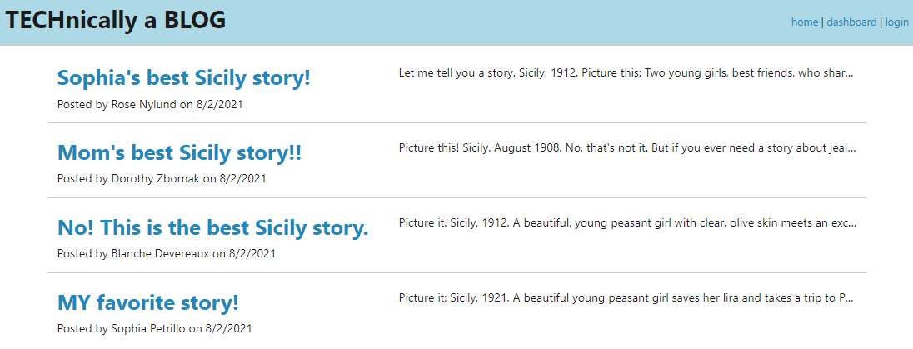

# MVC-Tech-Blog
## Licensing:

## Description
A CMS-style blog site, where users can publish their blog posts and comment on other users’ posts as well. This app follows the MVC paradigm in its architectural structure, uses Handlebars.js as the templating language, Sequelize as the ORM, and the express-session npm package for authentication. This app is deployed at Heroku https://tech-blog-mcq.herokuapp.com/
## Table of Contents
* [Installation](#Installation)
* [Usage](#Usage)
* [Technologies](#Technologies)
* [Next Steps](#Next)
* [Contributors](#Contributors)
* [Contact](#Contact)
## Installation
Fork this repo and download the files to your local environment. Install the dependencies and create a .env file.

1. Create the schema from the MySQL shell.
2. Seed the database with the command 'npm run seed'.
3. Start the application's server with the command 'npm start'.
4. App will run on localhost. Deploy to heroku for live site.
## Usage
#### _homepage_

#### _login_

#### _user dashboard_

#### _individual blog post with comments_

## Technologies
* JavaScript
* Node.js
* Express.js
* MySQL
* Sequelize
* Handlebars

## Next
The current app displays seeded comments to the single blog page locally, but not newly added comments. Additional functionality should include updating posts and deleting comments.
## Contributors
To contribute, please email me at the address below.
## Contact 
https://github.com/shelleymcq or email me at shelleymcq.dev@gmail.com